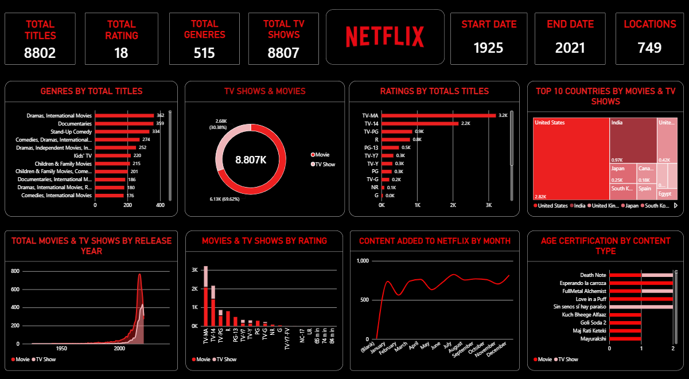

# Netflix Content Analysis using Power BI

## Project Overview

This project presents an analysis of Netflix content using Microsoft Power BI. The dashboard provides insights into movies and TV shows, ratings, countries, genres, and release years.

## Tools & Technologies

- Microsoft Power BI
- Microsoft Excel
- Netflix Titles Dataset

## Project Files

- [Power BI Dashboard](DashBoard.png)
- [Power BI Project](NET.pbix)
- [Dataset](netflix_titles.csv)
- [Project Report](Netflix%20project%20report.docx)
- [Project Presentation](Netflix_Content_Analysis_Professional_Presentation_With_Final_Dashboard.pptx)

## Key Insights

- Total Titles: 8,807
- Movies: 6,131
- TV Shows: 2,676
- Release Years: 1925–2021
- Most common rating: TV-MA

## Project Details

**Project:** Netflix Content Analysis  
**Tool:** Microsoft Power BI  
**Submitted By:** Gunda Swapthika  
**Trainer:** Mangali Rakesh

## Dashboard Preview

